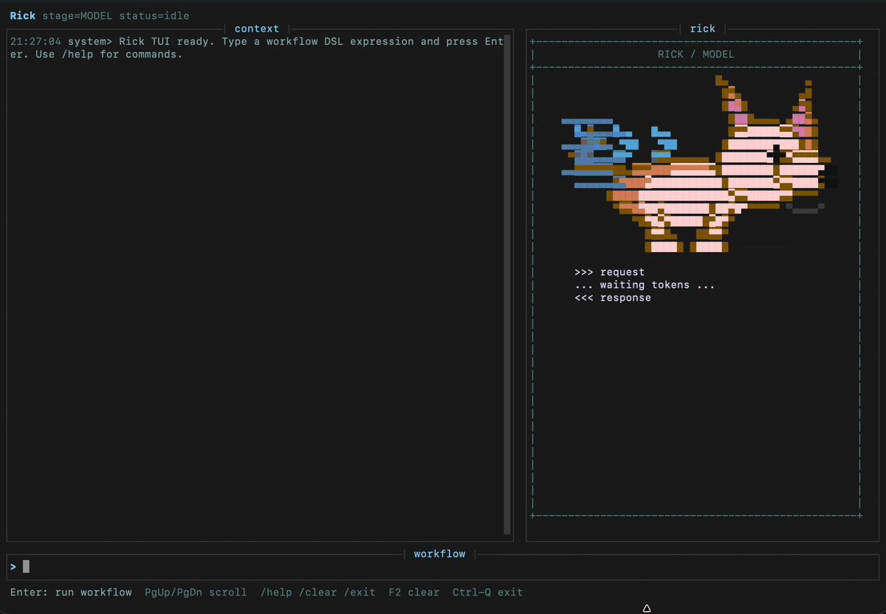

# Rick

Rick is a local CLI for turning one-shot LLM prompts into judged, logged workflows.

It is built for work where the first AI answer is not good enough: writing, product docs, refactoring plans, code generation, and any task where you want candidates, a judge, and a trace you can inspect later.



## Why Rick

Most AI tools optimize for a fast answer. Rick optimizes for a usable answer.

Instead of asking once and hoping, you define the task and Definition of Done, generate multiple candidates, judge them against the criteria, and only then produce the final artifact.

```text
RESOLVE("TASK","DOD")>GEN(plan,3)>JUDGE>GEN(draft,3)>JUDGE>EDIT(strict)
```

That gives you:

- multiple attempts instead of one lucky sample
- explicit criteria through the Definition of Done
- a judge step that compares candidates
- readable `log.md` and machine-readable `run.json`
- a local terminal UI for repeated workflow work
- safety gates for file writes, shell verification, and context access

Rick is not an autonomous agent. It is a small workflow runner for getting better LLM output with less guessing.

## Install

Recommended install with `uv`:

```bash
uv tool install git+https://github.com/para1992/rick.git
```

Or with `pipx`:

```bash
pipx install git+https://github.com/para1992/rick.git
```

Both install the same console commands:

```bash
rick --help
rick -i
```

For real OpenRouter runs, set an API key in your shell:

```bash
export OPENROUTER_API_KEY=...
```

Or create a `.env` file in the directory where you run Rick:

```env
OPENROUTER_API_KEY=...
OPENROUTER_MODEL_MEDIUM=google/gemini-2.0-flash-001
```

From a cloned checkout, you can start from the example file:

```bash
cp .env.example .env
```

Leave `OPENROUTER_API_KEY` empty to use the local mock client for CLI checks.

## Interactive Mode

```bash
rick -i
```

Or from a checkout without relying on the console script:

```bash
python3 -m rick_cli --interactive
```

Paste a workflow, press Enter, and Rick will stream the run into the terminal UI. Press `Ctrl-Q` to exit.

## One-Shot Mode

```bash
rick 'RESOLVE("Write a concise product brief","Must explain the problem, target user, value, and concrete takeaway")>GEN(plan,3)>JUDGE>GEN(draft,3)>JUDGE>EDIT(strict)' --mode LOG_STEP --run-dir runs/product-brief --max-calls 10
```

Outputs:

```text
runs/product-brief/run.json
runs/product-brief/log.md
```

## Workflow Pieces

```text
RESOLVE("TASK","DOD")       define the task and Definition of Done
CONTEXT(path)               add a local context file
GEN(artifact,n)             generate n candidates for an artifact
JUDGE                       select the strongest candidate
EDIT(strict)                produce a final edited artifact
OUTPUT_GLUE                 return the selected artifact directly
OUTPUT_AI_GLUE(strict)      use the model to combine selected artifacts
UNFOLD(source,child,n)      split a selected artifact into child artifacts
UNFOLD_JUDGE(source,child,n) split, generate candidates, and judge per unit
MATERIALIZE(path)           write generated files under runs/
VERIFY("command")           run a trusted shell check after materialization
```

If a workflow does not end with `OUTPUT_GLUE`, `OUTPUT_AI_GLUE(...)`, `EDIT(...)`, `MATERIALIZE(...)`, or `VERIFY(...)`, Rick appends `OUTPUT_GLUE`.

## Seeders

Rick uses seeders to make candidate generation more diverse and easier to audit.

For normal `GEN(...)` candidate generation, Rick uses a String Seed of Thought prompt. The model must first create a `<random_string>...</random_string>`, use it to make stochastic choices inside its private planning, and then return the final candidate JSON inside `<answer>...</answer>`.

Every generated candidate must include:

```json
{
  "seed": {
    "random_string": "<random_string>A7kP2mQ9zR</random_string>",
    "interpretation": "String manipulation shaped the candidate structure and tone."
  }
}
```

Rick stores that seed metadata in `run.json` and `log.md`, so you can see which candidate came from which seeded generation pass.

Where this lives in code:

- `rick_cli/prompts.py` defines the seed protocol prompt.
- `rick_cli/engine.py` enables seeders by default for artifact generation.
- `rick_cli/engine.py` validates `candidate.seed.random_string` and `candidate.seed.interpretation`.
- `rick_cli/llm.py` parses seeded model output from the `<answer>...</answer>` block.

Workspace prompt aliases can disable seeding for an artifact with `"seed": false`, but the default is `"seed": true`.

Separately, if you skip `JUDGE` between generation steps, Rick uses a runtime random seed to auto-select one candidate and logs that selection policy. That keeps implicit choices visible instead of silently picking the first answer.

## Copy-Paste Workflows To Try

### 1. Product Brief

Rick will create three competing product-brief plans, judge which plan best satisfies the Definition of Done, create three drafts from the winning plan, judge those drafts, and then edit the selected draft into one polished brief. Use this when you want a stronger positioning document than a single prompt usually gives you.

```text
RESOLVE("Write a product brief for a CLI tool that turns one-shot prompts into judged LLM workflows","500-700 words, explain the problem, target user, core workflow, why judging beats one-shot prompting, and one concrete adoption path")>GEN(plan,3)>JUDGE>GEN(draft,3)>JUDGE>EDIT(strict)
```

### 2. Technical ADR

Rick will first explore three possible ADR structures, select the strongest one, draft three full ADR candidates from that structure, select the best draft, and run a final strict edit. Use this when the output needs engineering shape: context, decision, alternatives, consequences, rollout, and risks.

```text
RESOLVE("Write an ADR for using staged LLM workflows instead of direct chat prompts in a developer tool","Include context, decision, alternatives considered, consequences, rollout plan, and risks. Be specific and engineering-focused.")>GEN(plan,3)>JUDGE>GEN(draft,3)>JUDGE>EDIT(strict)
```

### 3. Reddit-Style Story

Rick will generate three story outlines, pick the one with the best tension and ending, draft three complete story versions from that outline, judge them against tone and safety constraints, and edit the winner into a final first-person post. Use this to test long-form voice, pacing, and non-English writing quality.

```text
RESOLVE("Write a first-person Reddit story in Russian about a bad date where the narrator realizes the woman is being pulled into a cult","700-1000 words, conversational Russian, suspense, dark humor, no graphic violence, do not romanticize the cult, end with an uneasy aftertaste")>GEN(plan,3)>JUDGE>GEN(draft,3)>JUDGE>EDIT(strict)
```

### 4. LinkedIn Post

Rick will create three angles for the post, judge the strongest angle, draft three short posts from it, judge those drafts for specificity and lack of fluff, and edit the winner into a final concise post. Use this when you want practical social content without generic AI copy.

```text
RESOLVE("Write a short LinkedIn post for software developers about why judged multi-candidate workflows beat one-shot prompting","120-180 words, one concrete thesis, developer example, no marketing fluff, practical takeaway")>GEN(plan,3)>JUDGE>GEN(draft,3)>JUDGE>EDIT(strict)
```

### 5. Code Generation With Verification

Rick will generate three file manifests, judge which project structure best fits the browser-app requirements, expand the chosen manifest into implementation candidates per file/unit, write the selected files under `runs/canvas-square`, and run `node --check` against every generated JavaScript file. Use this for trusted local codegen where you want generation and verification in one recorded workflow.

```text
RESOLVE("Build a small browser app that shows a keyboard-controlled square on a canvas","Must include complete runnable files, no build step, and JavaScript must pass syntax checks")>GEN(file_manifest,3)>JUDGE>UNFOLD_JUDGE(file_manifest,file_implementation,2)>MATERIALIZE(runs/canvas-square)>VERIFY("find . -name '*.js' -print0 | xargs -0 -n1 node --check")
```

Run trusted verification workflows with:

```bash
rick 'RESOLVE("Build a small browser app that shows a keyboard-controlled square on a canvas","Must include complete runnable files, no build step, and JavaScript must pass syntax checks")>GEN(file_manifest,3)>JUDGE>UNFOLD_JUDGE(file_manifest,file_implementation,2)>MATERIALIZE(runs/canvas-square)>VERIFY("find . -name '\''*.js'\'' -print0 | xargs -0 -n1 node --check")' --mode LOG_STEP --run-dir runs/canvas-square-run --max-calls 20 --allow-verify
```

## Configuration

Rick reads environment variables from your shell and loads `.env` from the current directory. This keeps configuration local to the project where you run the tool.

```env
OPENROUTER_API_KEY=
OPENROUTER_MODEL=google/gemini-2.0-flash-001
OPENROUTER_MODEL_LOW=openrouter/free
OPENROUTER_MODEL_MEDIUM=google/gemini-2.0-flash-001
OPENROUTER_MODEL_HIGH=google/gemini-3.1-flash-lite-preview
RICK_MAX_CALLS=60
```

Security defaults block risky operations unless explicitly allowed:

- `CONTEXT` outside the current directory
- custom `OPENROUTER_BASE_URL`
- `VERIFY` shell commands
- `MATERIALIZE` outside `runs/`
- materializing dotfiles or overwriting existing files

## Development

```bash
git clone https://github.com/para1992/rick.git
cd rick
python3 -m pip install -r requirements.lock -e .
python3 -m pytest
python3 -m rick_cli --help
python3 -m pip wheel --no-deps . -w /tmp/rick-release-wheel
```

See [RELEASE.md](RELEASE.md) for the release checklist.

## Status

Rick is early `0.1.1` alpha software. The current focus is functional quality, workflow reliability, and useful regression packs.

## License

MIT.
